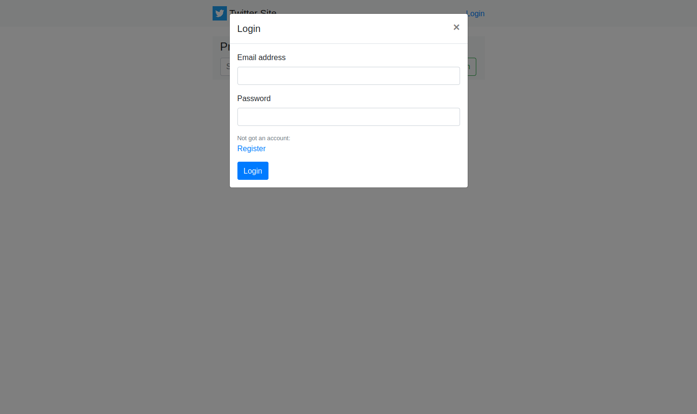
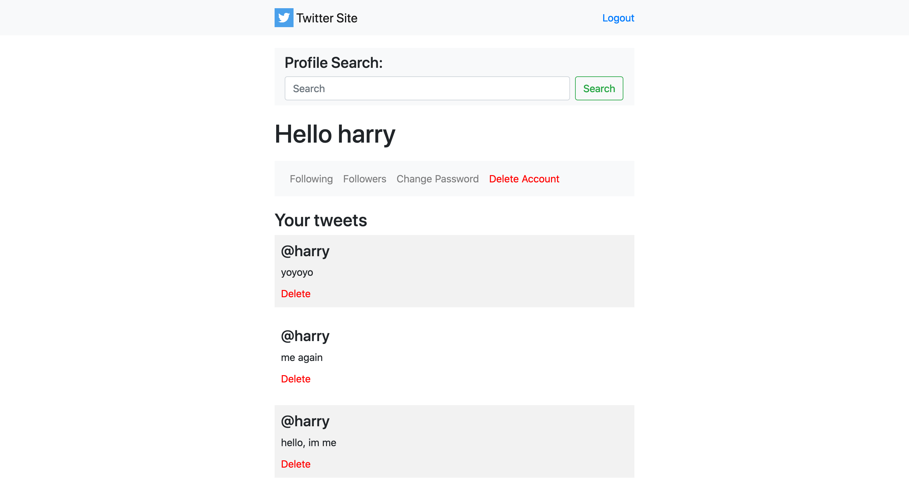

# Twitter-Clone
Twitter clone using NodeJS and plenty of modules.

This project was built over couple weeks in order to learn more about
nodejs as a language and create something that has some real world purpose.

Hope you enjoy looking around.

Install instructions are at the bottom.

~ Harry

## Features

The application has several features, lets look at them.

### Registration 

Login is presented using a Bootsrap modal, this then redirects to current page with logged in view.



### Account

Account pages has many options that are triggered by Bootsrap modals, such as 
change password and delete account. You can also view and delete your own tweets here.



### Profile 

Profiles can be viewed signed in or out and can be found via the search box. Search works by having to enter
the correct users name.


## Install

Installation is easy, all required modules are listed below, download and run.

### Node Setup 

```
$ npm install 
$ node server.js

```

### SQL table creations.

Schema is now available as import file. 


